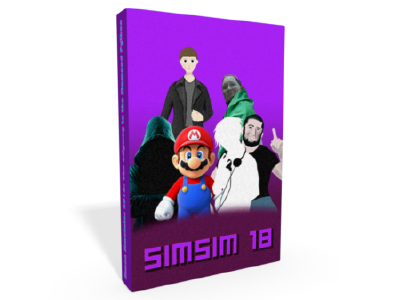

# Simon Simulator 2018: The odyssey to the Damned Python

Фанфик в сеттинге конференции идиотов.  
 

Прошел целый год и вот, перед вами обещанная визуальная новелла о приключениях Саймона с мудфм.  
Вам в роли Саймона необходимо собрать всю конференцию идиотов и с их помощью поймать проклятого питона.  
  
18+: Жестокость и нецензурная лексика в большом количестве  

#### Уникальные особенности:
* AAA Бюджет: 3000 рублей.
* AAA Время разработки: 4 дня.
* ААА Вообще всё (кроме этой игры).
* Сценарий 50к знаков, что примерно в 5 раз больше чем в [Simon Simulator 2016](https://github.com/TheStupidConference/simsim16/).
* Время чтения новеллы при средней скорости чтения занимает в районе 30-60 минут.
* Самый скучный человек в мире в качестве главного героя.
* Hatespeech-free: Настолько много ненависти ко всему живому и мертвому насколько это возможно.
* Интернациональная толерантная команда разработки: Среди разработчиков есть все народы. Или нет.
* Использованы самые передовые технологии движка Ren'Py.
* Пассивные элементы RPG. Возможность прокачки уровней и спецспособностей.
* Уникальная система взаимодействия между персонажами. Каждый персонаж это неповторимая личность со своими наборами навыков. А полностью собранная конференция идиотов это хорошо отточенный, слаженный механизм.
* Революционно-эволюционная система выбора действий - она убрана полностью. Это более честный и последовательный подход, потому что во всех современных RPG играх система выбора является иллюзорной. Мы не обманываем наших игроков.

#### Скачать
* Windows: 
* Linux: 
* Mac: 
* Android: 
